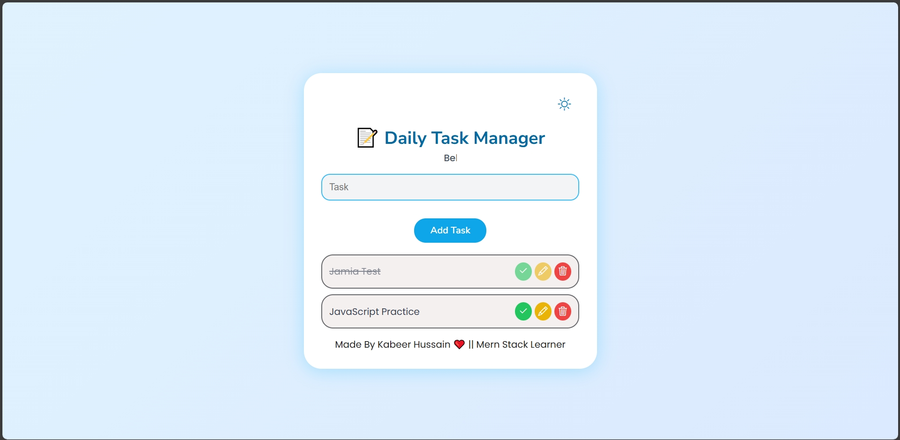

# 📝 To-Do Application (JavaScript Day 7)
**Live Demo:** [Click Here](https://task-mate-app-by-kabeer-hussain.vercel.app)

A clean and responsive **To-Do App** built using **HTML, CSS, and JavaScript**.  
Users can add, edit, complete, and delete tasks with **smooth animations**,  
**sound effects**, **confetti celebration**, and a **Dark 🌙 / Light ☀️ theme toggle**.

---

## 🚀 Features
- ✨ Add new tasks dynamically  
- 🖊 Edit tasks anytime  
- ✔ Mark tasks as completed (line-through + disabled buttons)  
- ❌ Delete tasks with confirmation  
- 🎉 Confetti animation on task completion  
- 🔊 Sound effects for complete & delete  
- 🌗 Light/Dark theme toggle  
- 📱 Fully responsive clean UI  
- ⚡ 100% JavaScript DOM — no frameworks  

---

## 🔧 Tech Stack
- **HTML** – Structure  
- **CSS** – Styling + Themes + Animations  
- **JavaScript** – DOM manipulation, sounds, logic  

---

## 🧠 How It Works
1. User writes a task in the input field  
2. Clicking **Add Task** dynamically creates a task row using JavaScript  
3. Each task row includes:
   - ✔️ Complete  
   - ✏️ Edit  
   - 🗑️ Delete  
4. On complete:
   - Task text gets striked-through  
   - Buttons disable  
   - Confetti + success sound  
5. On delete:
   - Confirmation box appears  
   - Delete sound plays  
6. Dark mode toggles using CSS class switching  
---

## 🎯 Learning Goals
- DOM manipulation  
- Event listeners  
- Updating elements dynamically  
- Handling user input  
- Creating reusable functions  
- Using CSS classes for theme toggling  
- Playing sound via JavaScript  
- Implementing small animations  

---

## 📸 Preview  

---

## 🛠️ Developer Info
👨‍💻 **Developer:** Kabeer Hussain  
📘 **Series:** JavaScript — *30 Days, 30 Projects*  
📆 **Day:** 7 — *Task Mate App*  
📧 **Email:** codealpha0786@gmail.com
🔗 **GitHub:** [ITechKabeer](https://github.com/ITechKabeer)

Made by Kabeer Hussain ❤️
